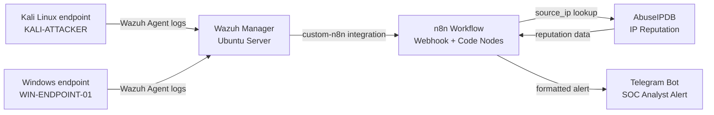

# Automated SOC Incident Response Lab using Wazuh, n8n, AbuseIPDB, and Telegram

This repository documents an end-to-end Security Operations Center lab that detects endpoint security events with Wazuh, forwards selected alerts to n8n, enriches them with AbuseIPDB threat intelligence, calculates a risk level, maps detections to MITRE ATT&CK, and notifies the analyst through Telegram.

The project demonstrates practical SOC skills across SIEM monitoring, endpoint telemetry, SOAR-style automation, threat intelligence enrichment, incident triage, and evidence-based reporting.

## SOC Flow

```text
Attack Simulation -> Wazuh Alert -> n8n Webhook -> Normalization
-> AbuseIPDB Enrichment -> Risk/MITRE Mapping -> Telegram Analyst Alert
```

## Lab Status

Implemented:

- Ubuntu Server running Wazuh Manager, Wazuh Indexer, Wazuh Dashboard, Docker, and n8n
- Windows 10 endpoint monitored by Wazuh Agent
- Kali Linux endpoint monitored by Wazuh Agent
- n8n workflow for alert intake, normalization, enrichment, formatting, and Telegram notification
- AbuseIPDB enrichment for source IP reputation
- Telegram bot notifications for SOC alerts
- Windows failed login detection
- Kali SSH failed login detection
- Wazuh custom integration that forwards relevant failed-login alerts to n8n

Planned / optional:

- TheHive case creation
- VirusTotal enrichment
- Automated blocking with analyst approval
- SLA tracking and case metrics

## Lab Environment

| Machine | Role | IP Address | Notes |
| --- | --- | --- | --- |
| Ubuntu Server | Wazuh + n8n server | `192.168.86.146` | Main SOC server |
| Windows 10 | Monitored endpoint | `192.168.86.140` | Wazuh agent ID `001` |
| Kali Linux | Monitored Linux endpoint / attacker simulation | `192.168.86.143` | Wazuh agent ID `002` |

## Tools Used

- Wazuh SIEM
- Wazuh Agent
- n8n
- Docker
- AbuseIPDB API
- Telegram Bot API
- VMware Workstation
- Ubuntu Server
- Windows 10
- Kali Linux

## Architecture



## n8n Workflow

Workflow name: `Wazuh Alert Intake`

Nodes:

1. `Webhook`
   Receives Wazuh alerts at `/webhook/wazuh-alert`.

2. `Normalize Wazuh Alert`
   Extracts important fields from both flat test alerts and real Wazuh JSON alerts.

3. `AbuseIPDB Check`
   Checks the alert source IP reputation.

4. `Format Telegram Alert`
   Combines normalized alert data with AbuseIPDB results and creates a readable SOC message.

5. `Telegram HTTP Request`
   Sends the final alert to the analyst through Telegram.

See [docs/n8n-workflows.md](docs/n8n-workflows.md).

## Wazuh Integration

Wazuh forwards selected failed-login alerts to n8n through a custom integration script:

- Script: [configs/custom-n8n.sh](configs/custom-n8n.sh)
- Wazuh config snippet: [configs/ossec-integration-snippet.xml](configs/ossec-integration-snippet.xml)

The current integration forwards failed-login style alerts such as:

- Windows Event ID `4625`
- Windows `Logon Failure`
- Linux/Kali `Failed password`
- Linux/Kali `Invalid user`
- Linux/Kali `authentication failure`
- SSHD-related failed authentication alerts

## Detection Scenarios Completed

| Scenario | Endpoint | Wazuh Rule / Event | Result |
| --- | --- | --- | --- |
| Windows failed login | Windows 10 | Event ID `4625`, rule `60122` | Detected and sent to Telegram |
| SSH failed login | Kali Linux | Rule `5710`, SSH invalid user | Detected and sent to Telegram |
| Public IP enrichment test | n8n simulated alert | Source IP `118.25.6.39` | AbuseIPDB enrichment successful |

See [docs/attack-scenarios.md](docs/attack-scenarios.md).

## Evidence

Recommended screenshots are listed in [screenshots/README.md](screenshots/README.md).

The strongest evidence set for this project is:

- Wazuh agents page showing Windows and Kali active
- n8n workflow canvas showing all nodes green
- n8n execution showing successful AbuseIPDB and Telegram nodes
- Telegram alert for Windows failed login
- Telegram alert for Kali SSH failed login
- Terminal output showing Wazuh agents active
- Terminal output showing Wazuh alert JSON for Windows and Kali detections

## Security Notes

Do not upload real secrets.

Before publishing this repository publicly:

- Regenerate the Telegram bot token because it was exposed during the lab.
- Regenerate the AbuseIPDB API key if it was exposed in screenshots or notes.
- Use `.env.example` only.
- Do not upload `.env`, real API keys, Wazuh passwords, certificates, or `wazuh-install-files.tar`.
- Blur or crop secrets from screenshots.

## Repository Structure

```text
README.md
.env.example
.gitignore
docs/
configs/
workflows/
screenshots/
reports/
```

## Documentation

- [Lab setup](docs/lab-setup.md)
- [Wazuh installation and agent setup](docs/wazuh-installation.md)
- [n8n workflow documentation](docs/n8n-workflows.md)
- [Attack scenarios](docs/attack-scenarios.md)
- [Incident response playbooks](docs/incident-response-playbooks.md)
- [Troubleshooting notes](docs/troubleshooting.md)
- [GitHub publishing checklist](docs/github-publishing-checklist.md)
- [Final project report](reports/final-project-report.md)

## CV Description

Built an automated SOC incident response lab using Wazuh SIEM and n8n SOAR-style workflows to detect, enrich, triage, and notify on security events including Windows failed logins and SSH authentication attacks.

Integrated AbuseIPDB and Telegram Bot API to automate threat intelligence enrichment, risk scoring, MITRE ATT&CK mapping, and analyst notifications, demonstrating end-to-end SOC automation from detection to response-ready alerting.
